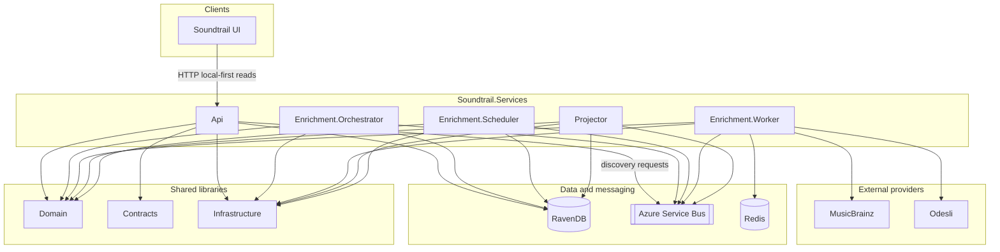

# Soundtrail.Services

Local-first music catalog discovery services for Soundtrail.

## Aim

Build a C# music catalog API that discovers metadata for a UI and enables track playback through supported streaming providers.

The API is **local-first**: it returns known catalog data quickly from RavenDB and records discovery requests when local data is incomplete. Discovery runs asynchronously. The API never calls MusicBrainz or Odesli directly.

| Concern | Choice |
| --- | --- |
| Canonical metadata | MusicBrainz |
| Playback references | Odesli / Songlink |
| Streaming providers | Apple Music, Spotify, YouTube Music |
| Read model | RavenDB projections |
| Source of truth | Event store |
| Messaging | Azure Service Bus |

Discovery is split intentionally:

- **Orchestrator** — prioritisation, deduplication, lifecycle, dispatching work
- **Worker** — provider admission (budget/leases) and third-party calls
- **Projector** — turns events into RavenDB read models the API serves

See [`specs/music-catalog-discovery-api-v2.md`](specs/music-catalog-discovery-api-v2.md) and related docs under [`specs/`](specs/).

## Solution architecture



**Runtime hosts** (also wired by Aspire AppHost for local development):

| Project | Role |
| --- | --- |
| `Soundtrail.Services.Api` | Local-first HTTP API (search, artists, albums, tracks, playlists) |
| `Soundtrail.Services.Enrichment.Orchestrator` | Discovery prioritisation and lifecycle |
| `Soundtrail.Services.Enrichment.Scheduler` | Backlog / scheduling host |
| `Soundtrail.Services.Enrichment.Worker` | Provider admission and external lookups |
| `Soundtrail.Services.Projector` | Event → RavenDB read-model projections |

**Shared libraries:** `Soundtrail.Domain`, `Soundtrail.Contracts`, `Soundtrail.Infrastructure`, `Soundtrail.Services.ServiceDefaults`.

## Developer build

Use the same PowerShell make script as CI. Pin the .NET SDK with [`global.json`](global.json) (`rollForward: disable`).

### Prerequisites

- .NET SDK **exactly** the version in [`global.json`](global.json)
- PowerShell 7+ (`pwsh`)
- Docker (integration / end-to-end Testcontainers: Redis, Azure Service Bus emulator)

### Host build

```powershell
./build.ps1 -Restore
```

`-Restore` restores packages (locked-mode in CI) then builds and runs the test pack. Omit `-Restore` only when `project.assets.json` is already present and you want compile/test with `--no-restore`.

Useful switches:

```powershell
./build.ps1 -Clean
./build.ps1 -Restore -TestFilter "FullyQualifiedName~Soundtrail.Services.Tests.Unit"
./build.ps1 -TestFilter "FullyQualifiedName~Soundtrail.Services.Tests.EndToEnd"
./build.ps1 -Configuration Debug
```

Default CI path restores, builds, then runs the full test pack (unit + integration + end-to-end) and writes a TRX report under `reports/`.

End-to-end tests start RavenDB Embedded in-process, WireMock in-process, and Azure Service Bus emulator + Redis via Testcontainers. Docker must be running; you do not need to start compose yourself. Queue names are fixed in code (`ServiceBusQueues`); configure only `ServiceBus:ConnectionString`.

```bash
dotnet test tests/Soundtrail.Services.Tests/Soundtrail.Services.Tests.csproj \
  --filter "FullyQualifiedName~Soundtrail.Services.Tests.EndToEnd"
```

### CI

GitHub Actions installs the SDK from [`global.json`](global.json) via `actions/setup-dotnet`, verifies `dotnet --version` matches exactly, then runs [`build.ps1 -Restore`](build.ps1) on the runner (host Docker for Testcontainers). See [`.github/workflows/ci.yml`](.github/workflows/ci.yml).

The PR check is the workflow job **Build \<SemVer\>** (plus a **Test Results** annotation on pull requests). To block merges until it passes, in GitHub go to **Settings → Rules → Rulesets** (or **Branches → Branch protection**) for `main` and require that Build status check.

## Further reading

- [`CODING-STANDARDS.md`](CODING-STANDARDS.md) — solution shape, feature folders, testing approach
- [`specs/`](specs/) — discovery API, prioritisation/admission layering, event sourcing, TrackId
