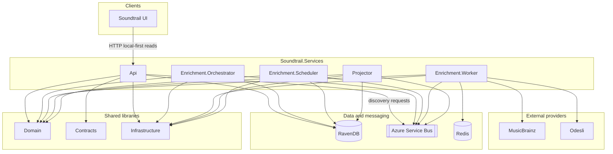

# Soundtrail.Services

Local-first music catalog discovery services for Soundtrail.

## Aim

Build a C# music catalog API that discovers metadata for a UI and enables track playback through supported streaming providers.

The API is **local-first**: it returns known catalog data quickly from RavenDB and records discovery requests when local data is incomplete. Discovery runs asynchronously. The API never calls MusicBrainz or Odesli directly.

| Concern | Choice |
| --- | --- |
| Canonical metadata | MusicBrainz |
| Playback references | Odesli / Songlink |
| Streaming providers | Apple Music, Spotify, YouTube Music |
| Read model | RavenDB projections |
| Source of truth | Event store |
| Messaging | Azure Service Bus |

Discovery is split intentionally:

- **Orchestrator** — prioritisation, deduplication, lifecycle, dispatching work
- **Worker** — provider admission (budget/leases) and third-party calls
- **Projector** — turns events into RavenDB read models the API serves

See [`specs/music-catalog-discovery-api-v2.md`](specs/music-catalog-discovery-api-v2.md) and related docs under [`specs/`](specs/).

## Solution architecture



**Runtime hosts** (also wired by Aspire AppHost for local development):

| Project | Role |
| --- | --- |
| `Soundtrail.Services.Api` | Local-first HTTP API (search, artists, albums, tracks, playlists) |
| `Soundtrail.Services.Enrichment.Orchestrator` | Discovery prioritisation and lifecycle |
| `Soundtrail.Services.Enrichment.Scheduler` | Backlog / scheduling host |
| `Soundtrail.Services.Enrichment.Worker` | Provider admission and external lookups |
| `Soundtrail.Services.Projector` | Event → RavenDB read-model projections |

**Shared libraries:** `Soundtrail.Domain`, `Soundtrail.Contracts`, `Soundtrail.Infrastructure`, `Soundtrail.Services.ServiceDefaults`.

## Developer build

Use the same PowerShell make script and container image as CI for consistent restore/build/test behaviour.

### Prerequisites

- Docker
- PowerShell 7+ (`pwsh`) if running the script on the host
- .NET SDK matching [`global.json`](global.json) if running outside the container

### Consistent build (container — preferred)

```bash
docker build -t soundtrail-services-ci:local -f .github/docker/Dockerfile.ci .

docker run --rm \
  -v "$PWD:/src" \
  -w /src \
  soundtrail-services-ci:local \
  pwsh ./build.ps1 -Restore

docker run --rm \
  -v "$PWD:/src" \
  -v /var/run/docker.sock:/var/run/docker.sock \
  --add-host=host.docker.internal:host-gateway \
  -e TESTCONTAINERS_HOST_OVERRIDE=host.docker.internal \
  -e TESTCONTAINERS_RYUK_DISABLED=true \
  -w /src \
  soundtrail-services-ci:local \
  pwsh ./build.ps1
```

The Docker socket mount is required so integration tests can start Testcontainers (Redis).

### Host build

```powershell
./build.ps1 -Restore
./build.ps1
```

Useful switches:

```powershell
./build.ps1 -Clean
./build.ps1 -TestFilter "FullyQualifiedName~Soundtrail.Services.Tests.Unit"
./build.ps1 -Configuration Debug
```

Default CI path runs unit tests then integration tests and writes TRX reports under `reports/`.

### CI

GitHub Actions builds [`.github/docker/Dockerfile.ci`](.github/docker/Dockerfile.ci) (pinned .NET SDK + PowerShell) and runs [`build.ps1`](build.ps1) inside that image. See [`.github/workflows/ci.yml`](.github/workflows/ci.yml).

## Further reading

- [`CODING-STANDARDS.md`](CODING-STANDARDS.md) — solution shape, feature folders, testing approach
- [`specs/`](specs/) — discovery API, prioritisation/admission layering, event sourcing, TrackId
