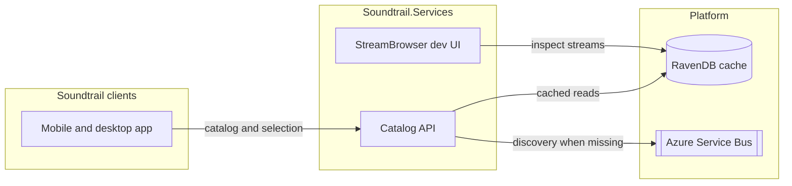
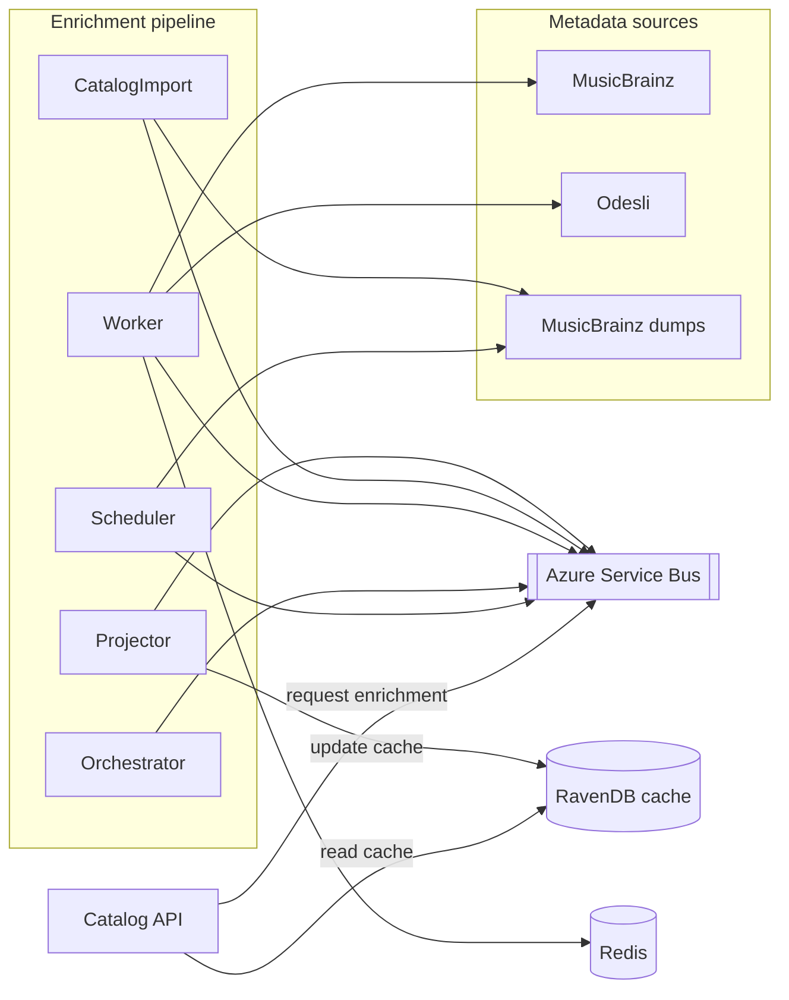

# Soundtrail.Services

[](https://github.com/chris27uk/soundtrail-services/actions/workflows/ci.yml)

> **Active development.** This repository has not reached a usable state. APIs, data models, and deployment are still evolving; breaking changes are expected. There is no supported public deployment.

## Goal

Soundtrail is a mobile and desktop app designed to integrate with Sonos and address common pain points, including unexpected playback. This repository provides the backend **music catalog services** and **customer music selection** data that Soundtrail clients consume.

## How it works

Soundtrail.Services **syndicates music metadata** from canonical and provider-specific sources (MusicBrainz for catalog facts, Odesli/Songlink for streaming links, plus bulk MusicBrainz dumps for seed data). Results are **stored and projected into RavenDB** so repeat lookups are served from cache instead of hitting external APIs on every request.

When a client asks for something not yet in cache, the API **records a discovery request** and returns what it already knows. Background workers fetch missing metadata asynchronously, under rate limits, and update the cache via an event-sourced pipeline. The API **does not call MusicBrainz or Odesli directly** on the request path.

## What this repo provides

- An HTTP catalog API for search, artists, albums, tracks, and playlists
- An async enrichment pipeline that syndicates metadata from MusicBrainz, Odesli, and dump imports
- Cached RavenDB read models for fast repeat lookups
- Playback references for Apple Music, Spotify, and YouTube Music
- Local Aspire AppHost wiring for development

## Development status

This backend is **not production-ready**. Treat it as an in-progress service layer for the Soundtrail app:

- Interfaces and document shapes will change
- There is no supported public API or deployment story
- Do not integrate a client against these services expecting stability

## Solution architecture

Clients talk only to the catalog API. The API answers from the RavenDB cache and queues enrichment when metadata is incomplete. Enrichment hosts consume Azure Service Bus messages, fetch from external sources under budget, and emit events. The projector applies those events back into RavenDB so later lookups are faster. CatalogImport and Scheduler seed and schedule bulk MusicBrainz dump work without per-item API calls.

### System context



### Metadata syndication pipeline



**Runtime hosts** (wired by Aspire AppHost for local development):

| Project | Role |
| --- | --- |
| `Soundtrail.Services.Api` | HTTP API for search, artists, albums, tracks, playlists — reads cached projections, queues discovery |
| `Soundtrail.Services.Enrichment.Orchestrator` | Discovery prioritisation and lifecycle |
| `Soundtrail.Services.Enrichment.Scheduler` | Backlog / dump scheduling |
| `Soundtrail.Services.Enrichment.Worker` | Fetches metadata from external sources under rate limits |
| `Soundtrail.Services.Enrichment.CatalogImport` | Bulk MusicBrainz dump import into the event store |
| `Soundtrail.Services.Projector` | Applies events to RavenDB read models (cache updates) |
| `Soundtrail.Services.StreamBrowser` | Dev UI for inspecting event streams (not a production client surface) |

**Shared libraries:** `Soundtrail.Domain`, `Soundtrail.Contracts`, `Soundtrail.Infrastructure`, `Soundtrail.Services.ServiceDefaults`.

### Design choices

| Concern | Choice |
| --- | --- |
| Canonical metadata | MusicBrainz (+ bulk dumps) |
| Playback references | Odesli / Songlink |
| Streaming providers | Apple Music, Spotify, YouTube Music |
| Lookup cache | RavenDB projections |
| Source of truth | Event store |
| Async enrichment | Azure Service Bus |

See [`specs/music-catalog-discovery-api-v2.md`](specs/music-catalog-discovery-api-v2.md) and related docs under [`specs/`](specs/).

## Developer guide

Local default is [`build.ps1`](build.ps1) with the SDK in [`global.json`](global.json), RavenDB Embedded, and Testcontainers.

### Prerequisites

- .NET SDK matching [`global.json`](global.json) (currently 10.0.300)
- PowerShell 7+ (`pwsh`)
- Docker (required for integration / end-to-end Testcontainers, and for AppHost containers)

### Build and test

```powershell
./build.ps1 -Restore
```

`-Restore` restores packages then builds and runs the full test pack. Omit `-Restore` only when `project.assets.json` is already present and you want compile/test with `--no-restore`.

Useful switches:

```powershell
./build.ps1 -Clean
./build.ps1 -Restore -TestFilter "FullyQualifiedName~Soundtrail.Services.Tests.Unit"
./build.ps1 -TestFilter "FullyQualifiedName~Soundtrail.Services.Tests.EndToEnd"
./build.ps1 -Configuration Debug
```

End-to-end tests start RavenDB Embedded in-process, WireMock in-process, and Azure Service Bus emulator + Redis via Testcontainers. Docker must be running; you do not need to start compose yourself. Queue names are fixed in code (`ServiceBusQueues`); configure only `ServiceBus:ConnectionString`.

```bash
dotnet test tests/Soundtrail.Services.Tests/Soundtrail.Services.Tests.csproj \
  --filter "FullyQualifiedName~Soundtrail.Services.Tests.EndToEnd"
```

### Run locally with Aspire

```bash
aspire start --apphost ./Soundtrail.Services.AppHost
```

Useful local URLs:

- Catalog API: `http://api.localhost`
- StreamBrowser: `http://streams.localhost`
- RavenDB Studio: `http://ravendb.localhost/studio/index.html`

Emulator and provider-stub toggles live in [`Soundtrail.Services.AppHost/appsettings.Development.json`](Soundtrail.Services.AppHost/appsettings.Development.json). For MusicBrainz dump import during local runs, see [`Soundtrail.Services.AppHost/testdata/musicbrainz-dump-source/README.md`](Soundtrail.Services.AppHost/testdata/musicbrainz-dump-source/README.md).

### CI parity (optional)

CI does **not** use Embedded Raven or Testcontainers. It publishes the testhost with the pinned runner SDK and runs those bits in the ASP.NET container next to Redis, OpenServiceBus, and RavenDB 7.2.5. The Dockerfile target remains useful for local parity:

```bash
docker build -t soundtrail-testhost:ci --target testhost -f Dockerfile.ci .
mkdir -p reports
docker compose -f docker-compose.ci.yml up -d redis openservicebus ravendb
docker compose -f docker-compose.ci.yml run --rm --no-deps testhost
docker compose -f docker-compose.ci.yml down -v
```

Point a host-run testhost at the same sidecars with `SOUNDTRAIL_TEST_NO_TESTCONTAINERS=1`, `SOUNDTRAIL_TEST_REDIS`, `SOUNDTRAIL_TEST_SERVICEBUS`, and `SOUNDTRAIL_TEST_RAVEN`.

GitHub Actions restores a default-branch NuGet cache and runs `./build.ps1 -Restore -CiTesthost`. Sidecars come from [`docker-compose.ci.yml`](docker-compose.ci.yml). See [`.github/workflows/ci.yml`](.github/workflows/ci.yml).

The PR check is the workflow job **Build** (plus a **Test Results** annotation on pull requests).

## Further reading

- [`CODING-STANDARDS.md`](CODING-STANDARDS.md) — solution shape, feature folders, testing approach
- [`specs/`](specs/) — discovery API, prioritisation/admission layering, event sourcing, TrackId
