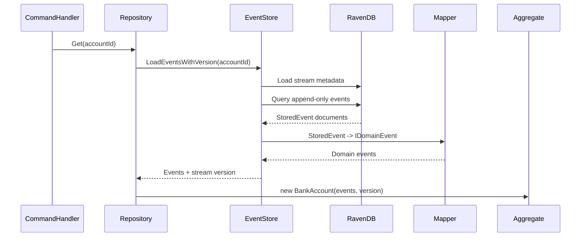
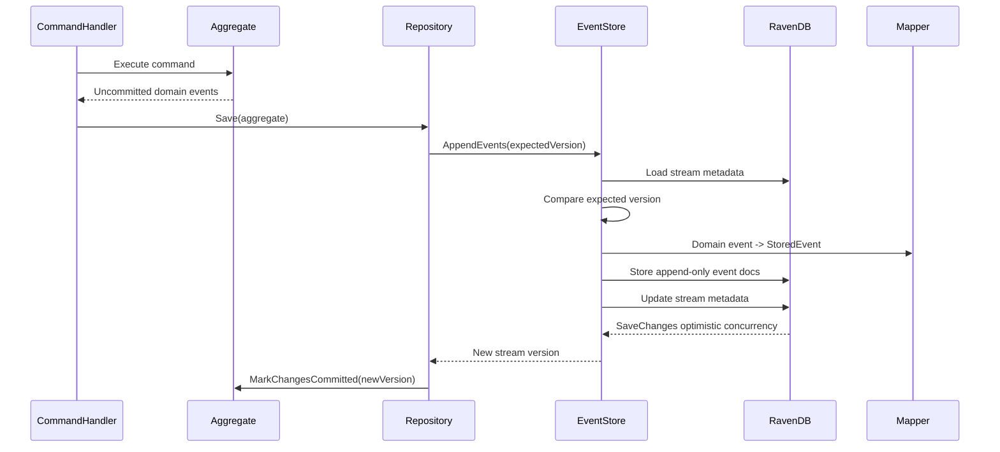

# Event-Sourced Aggregate Pattern Without Reflection

## Production RavenDB Event Store Version

This version keeps the aggregate completely free of persistence concerns while using a production-oriented RavenDB event-store design.

The aggregate only knows about:

- Domain state
- Domain events
- Business rules
- Explicit event handler registration

The aggregate does not know about:

- DTOs
- RavenDB documents
- Serialization
- Event metadata
- Storage versioning mechanics
- Projection documents
- Snapshots

---

# Architecture

```text
Command Handler
     |
     v
Aggregate
     |
     | emits domain events
     v
Repository
     |
     | maps domain events <-> event DTOs
     v
RavenDB Event Store
     |
     +--> Append-only Event Documents
     +--> Stream Metadata Document
     +--> Optional Snapshot Document
     +--> Projections / Read Models
```

---

# Core Design Principles

## 1. Aggregate Purity

Aggregates operate only on domain events.

```csharp
public interface IDomainEvent
{
}
```

Persistence models are kept outside the domain layer.

## 2. Append-Only Events

Each event is stored as an individual RavenDB document.

This avoids the unbounded growth problem of a single event stream document.

## 3. Stream Metadata for Concurrency

A small stream metadata document stores the current stream version.

This document is used for optimistic concurrency checks.

## 4. DTO Mapping at the Repository Boundary

The repository maps between persisted event DTOs and domain events.

## 5. Projections Are Separate

Read models are built from persisted events and are not used by the aggregate.

---

# Domain Events

```csharp
public sealed record BankAccountOpened(Guid AccountId)
    : IDomainEvent;

public sealed record MoneyDeposited(
    Guid AccountId,
    decimal Amount)
    : IDomainEvent;

public sealed record BankAccountClosed(Guid AccountId)
    : IDomainEvent;
```

---

# Event Handler Registry

```csharp
public sealed class EventHandlers<TAggregate>
{
    private readonly Dictionary<Type, Action<TAggregate, IDomainEvent>>
        _handlers = new();

    public void Register<TEvent>(
        Action<TAggregate, TEvent> handler)
        where TEvent : IDomainEvent
    {
        _handlers[typeof(TEvent)] =
            (aggregate, @event) =>
                handler(aggregate, (TEvent)@event);
    }

    public void Handle(
        TAggregate aggregate,
        IDomainEvent @event)
    {
        var eventType = @event.GetType();

        if (!_handlers.TryGetValue(eventType, out var handler))
        {
            throw new InvalidOperationException(
                $"No handler registered for event type {eventType.Name}");
        }

        handler(aggregate, @event);
    }
}
```

---

# Aggregate Example

```csharp
public sealed class BankAccount
{
    private static readonly EventHandlers<BankAccount>
        EventHandlers = CreateEventHandlers();

    private readonly List<IDomainEvent>
        _uncommittedEvents = [];

    public Guid Id { get; private set; }

    public decimal Balance { get; private set; }

    public bool IsClosed { get; private set; }

    public long Version { get; private set; }

    public IReadOnlyCollection<IDomainEvent> UncommittedEvents =>
        _uncommittedEvents;

    public BankAccount(
        IEnumerable<IDomainEvent> events,
        long version)
    {
        foreach (var @event in events)
        {
            Apply(@event, isNew: false);
        }

        Version = version;
    }

    public static BankAccount Open(Guid id)
    {
        var account = new BankAccount([], version: 0);

        account.Apply(
            new BankAccountOpened(id),
            isNew: true);

        return account;
    }

    public void Deposit(decimal amount)
    {
        if (IsClosed)
        {
            throw new InvalidOperationException(
                "Account is closed.");
        }

        if (amount <= 0)
        {
            throw new ArgumentOutOfRangeException(
                nameof(amount));
        }

        Apply(
            new MoneyDeposited(Id, amount),
            isNew: true);
    }

    public void Close()
    {
        if (IsClosed)
        {
            return;
        }

        Apply(
            new BankAccountClosed(Id),
            isNew: true);
    }

    public void MarkChangesCommitted(
        long newVersion)
    {
        Version = newVersion;
        _uncommittedEvents.Clear();
    }

    private void Apply(
        IDomainEvent @event,
        bool isNew)
    {
        EventHandlers.Handle(this, @event);

        if (isNew)
        {
            _uncommittedEvents.Add(@event);
        }
    }

    private static EventHandlers<BankAccount>
        CreateEventHandlers()
    {
        var handlers = new EventHandlers<BankAccount>();

        handlers.Register<BankAccountOpened>(
            (account, @event) => account.Handle(@event));

        handlers.Register<MoneyDeposited>(
            (account, @event) => account.Handle(@event));

        handlers.Register<BankAccountClosed>(
            (account, @event) => account.Handle(@event));

        return handlers;
    }

    private void Handle(BankAccountOpened @event)
    {
        Id = @event.AccountId;
        Balance = 0;
        IsClosed = false;
    }

    private void Handle(MoneyDeposited @event)
    {
        Balance += @event.Amount;
    }

    private void Handle(BankAccountClosed @event)
    {
        IsClosed = true;
    }
}
```

---

# RavenDB Storage Model

## Event Document

Each domain event is stored as a separate append-only document.

```csharp
public sealed class StoredEvent
{
    public string Id { get; set; } = default!;

    public Guid AggregateId { get; set; }

    public string AggregateType { get; set; } = default!;

    public long Version { get; set; }

    public string EventType { get; set; } = default!;

    public string Data { get; set; } = default!;

    public DateTimeOffset OccurredAtUtc { get; set; }

    public string? CorrelationId { get; set; }

    public string? CausationId { get; set; }
}
```

Example document ids:

```text
events/bank-account/8f4f4e72-8f5d-4675-b624-6dfe7b8ab924/0000000001
events/bank-account/8f4f4e72-8f5d-4675-b624-6dfe7b8ab924/0000000002
events/bank-account/8f4f4e72-8f5d-4675-b624-6dfe7b8ab924/0000000003
```

---

## Stream Metadata Document

The stream metadata document is small and updated on every append.

```csharp
public sealed class EventStreamMetadata
{
    public string Id { get; set; } = default!;

    public Guid AggregateId { get; set; }

    public string AggregateType { get; set; } = default!;

    public long Version { get; set; }

    public DateTimeOffset UpdatedAtUtc { get; set; }
}
```

Example id:

```text
streams/bank-account/8f4f4e72-8f5d-4675-b624-6dfe7b8ab924
```

This document is the concurrency boundary.

---

# DTO Mapping

## Mapper Contract

```csharp
public interface IEventMapper
{
    IDomainEvent ToDomain(StoredEvent storedEvent);

    StoredEvent ToStoredEvent(
        Guid aggregateId,
        string aggregateType,
        long version,
        IDomainEvent domainEvent,
        EventMetadata metadata);
}
```

## Metadata Object

```csharp
public sealed record EventMetadata(
    string? CorrelationId,
    string? CausationId,
    DateTimeOffset OccurredAtUtc);
```

## Mapper Implementation

```csharp
public sealed class EventMapper : IEventMapper
{
    public IDomainEvent ToDomain(
        StoredEvent storedEvent)
    {
        return storedEvent.EventType switch
        {
            nameof(BankAccountOpened) =>
                JsonSerializer.Deserialize<BankAccountOpened>(
                    storedEvent.Data)!,

            nameof(MoneyDeposited) =>
                JsonSerializer.Deserialize<MoneyDeposited>(
                    storedEvent.Data)!,

            nameof(BankAccountClosed) =>
                JsonSerializer.Deserialize<BankAccountClosed>(
                    storedEvent.Data)!,

            _ => throw new InvalidOperationException(
                $"Unknown event type {storedEvent.EventType}")
        };
    }

    public StoredEvent ToStoredEvent(
        Guid aggregateId,
        string aggregateType,
        long version,
        IDomainEvent domainEvent,
        EventMetadata metadata)
    {
        return new StoredEvent
        {
            Id = CreateEventId(
                aggregateType,
                aggregateId,
                version),

            AggregateId = aggregateId,
            AggregateType = aggregateType,
            Version = version,
            EventType = domainEvent.GetType().Name,

            Data = JsonSerializer.Serialize(
                domainEvent,
                domainEvent.GetType()),

            OccurredAtUtc = metadata.OccurredAtUtc,
            CorrelationId = metadata.CorrelationId,
            CausationId = metadata.CausationId
        };
    }

    private static string CreateEventId(
        string aggregateType,
        Guid aggregateId,
        long version)
    {
        return
            $"events/{aggregateType}/{aggregateId}/{version:D10}";
    }
}
```

---

# Event Store Contract

```csharp
public interface IEventStore
{
    Task<IReadOnlyList<IDomainEvent>> LoadEvents(
        Guid aggregateId);

    Task<EventStreamLoadResult> LoadEventsWithVersion(
        Guid aggregateId);

    Task<long> AppendEvents(
        Guid aggregateId,
        long expectedVersion,
        IReadOnlyCollection<IDomainEvent> events,
        EventMetadata metadata);
}
```

```csharp
public sealed record EventStreamLoadResult(
    IReadOnlyList<IDomainEvent> Events,
    long Version);
```

---

# RavenDB Event Store Implementation

```csharp
public sealed class RavenDbEventStore : IEventStore
{
    private const string AggregateType = "bank-account";

    private readonly IDocumentStore _documentStore;

    private readonly IEventMapper _mapper;

    public RavenDbEventStore(
        IDocumentStore documentStore,
        IEventMapper mapper)
    {
        _documentStore = documentStore;
        _mapper = mapper;
    }

    public async Task<IReadOnlyList<IDomainEvent>> LoadEvents(
        Guid aggregateId)
    {
        var result =
            await LoadEventsWithVersion(aggregateId);

        return result.Events;
    }

    public async Task<EventStreamLoadResult> LoadEventsWithVersion(
        Guid aggregateId)
    {
        using var session =
            _documentStore.OpenAsyncSession();

        var streamId =
            CreateStreamId(aggregateId);

        var metadata =
            await session.LoadAsync<EventStreamMetadata>(
                streamId);

        if (metadata is null)
        {
            return new EventStreamLoadResult([], 0);
        }

        var storedEvents =
            await session.Query<StoredEvent>()
                .Where(x =>
                    x.AggregateId == aggregateId &&
                    x.AggregateType == AggregateType)
                .OrderBy(x => x.Version)
                .ToListAsync();

        var domainEvents =
            storedEvents
                .Select(_mapper.ToDomain)
                .ToList();

        return new EventStreamLoadResult(
            domainEvents,
            metadata.Version);
    }

    public async Task<long> AppendEvents(
        Guid aggregateId,
        long expectedVersion,
        IReadOnlyCollection<IDomainEvent> events,
        EventMetadata metadata)
    {
        if (events.Count == 0)
        {
            return expectedVersion;
        }

        using var session =
            _documentStore.OpenAsyncSession();

        session.Advanced.UseOptimisticConcurrency = true;

        var streamId =
            CreateStreamId(aggregateId);

        var stream =
            await session.LoadAsync<EventStreamMetadata>(
                streamId);

        if (stream is null)
        {
            if (expectedVersion != 0)
            {
                throw new ConcurrencyException(
                    "Expected an existing event stream.");
            }

            stream = new EventStreamMetadata
            {
                Id = streamId,
                AggregateId = aggregateId,
                AggregateType = AggregateType,
                Version = 0,
                UpdatedAtUtc = metadata.OccurredAtUtc
            };

            await session.StoreAsync(stream, streamId);
        }

        if (stream.Version != expectedVersion)
        {
            throw new ConcurrencyException(
                $"Expected version {expectedVersion}, " +
                $"but found version {stream.Version}.");
        }

        var nextVersion = stream.Version;

        foreach (var @event in events)
        {
            nextVersion++;

            var storedEvent =
                _mapper.ToStoredEvent(
                    aggregateId,
                    AggregateType,
                    nextVersion,
                    @event,
                    metadata);

            await session.StoreAsync(
                storedEvent,
                storedEvent.Id);
        }

        stream.Version = nextVersion;
        stream.UpdatedAtUtc = metadata.OccurredAtUtc;

        await session.SaveChangesAsync();

        return nextVersion;
    }

    private static string CreateStreamId(
        Guid aggregateId)
    {
        return
            $"streams/{AggregateType}/{aggregateId}";
    }
}
```

---

# Optimistic Concurrency Strategy

Optimistic concurrency is enforced in two ways.

## 1. Domain-Level Expected Version

The repository saves using the aggregate version that was loaded.

```csharp
await eventStore.AppendEvents(
    aggregateId: account.Id,
    expectedVersion: account.Version,
    events: account.UncommittedEvents,
    metadata: metadata);
```

If another process has already appended events, the stream metadata version will no longer match.

## 2. RavenDB Session-Level Optimistic Concurrency

```csharp
session.Advanced.UseOptimisticConcurrency = true;
```

This ensures RavenDB rejects conflicting writes to the stream metadata document.

---

# Repository

```csharp
public sealed class BankAccountRepository
{
    private readonly IEventStore _eventStore;

    public BankAccountRepository(
        IEventStore eventStore)
    {
        _eventStore = eventStore;
    }

    public async Task<BankAccount?> Get(
        Guid accountId)
    {
        var result =
            await _eventStore.LoadEventsWithVersion(
                accountId);

        if (result.Events.Count == 0)
        {
            return null;
        }

        return new BankAccount(
            result.Events,
            result.Version);
    }

    public async Task Save(
        BankAccount account,
        EventMetadata metadata)
    {
        var newVersion =
            await _eventStore.AppendEvents(
                account.Id,
                account.Version,
                account.UncommittedEvents,
                metadata);

        account.MarkChangesCommitted(newVersion);
    }
}
```

---

# Snapshot Support

Snapshots are optional.

They are useful when an aggregate has a very long event stream.

## Snapshot Document

```csharp
public sealed class AggregateSnapshot
{
    public string Id { get; set; } = default!;

    public Guid AggregateId { get; set; }

    public string AggregateType { get; set; } = default!;

    public long Version { get; set; }

    public string Data { get; set; } = default!;

    public DateTimeOffset CreatedAtUtc { get; set; }
}
```

Example id:

```text
snapshots/bank-account/8f4f4e72-8f5d-4675-b624-6dfe7b8ab924
```

## Snapshot Load Flow

```text
1. Load latest snapshot.
2. Load events after snapshot version.
3. Rehydrate aggregate from snapshot state.
4. Replay remaining events.
```

Snapshots should be treated as a performance optimization only.

The event stream remains the source of truth.

---

# Projection Example

A projection creates read-optimized documents.

## Read Model

```csharp
public sealed class BankAccountSummary
{
    public string Id { get; set; } = default!;

    public Guid AccountId { get; set; }

    public decimal Balance { get; set; }

    public bool IsClosed { get; set; }

    public long Version { get; set; }
}
```

## Projection Handler

```csharp
public sealed class BankAccountSummaryProjection
{
    public void Apply(
        BankAccountSummary summary,
        BankAccountOpened @event,
        long version)
    {
        summary.AccountId = @event.AccountId;
        summary.Balance = 0;
        summary.IsClosed = false;
        summary.Version = version;
    }

    public void Apply(
        BankAccountSummary summary,
        MoneyDeposited @event,
        long version)
    {
        summary.Balance += @event.Amount;
        summary.Version = version;
    }

    public void Apply(
        BankAccountSummary summary,
        BankAccountClosed @event,
        long version)
    {
        summary.IsClosed = true;
        summary.Version = version;
    }
}
```

---

# Load Flow



---

# Save Flow



---

# Concurrency Conflict Example

```text
Current stream version: 4

Process A loads aggregate at version 4.
Process B loads aggregate at version 4.

Process A appends event 5 successfully.
Stream version becomes 5.

Process B attempts to append event 5.
Expected version is 4.
Actual version is 5.

Repository throws ConcurrencyException.
```

The command can then be retried by reloading the aggregate and reapplying the command.

---

# Advantages

## Aggregate Remains Clean

No DTOs or persistence concepts leak into the aggregate.

## Append-Only Event History

Each event is immutable and independently addressable.

## Smaller Write Boundary

Only stream metadata is updated on append.

## Optimistic Concurrency

Expected version and RavenDB concurrency protect against lost updates.

## Better Scalability Than Single Stream Document

The event stream can grow without creating one huge RavenDB document.

## Projection Friendly

Read models can be rebuilt from events.

## Snapshot Friendly

Snapshots can speed up rehydration without changing the event source of truth.

---

# Recommended Folder Structure

```text
Domain/
  BankAccount.cs
  IDomainEvent.cs
  Events/
    BankAccountOpened.cs
    MoneyDeposited.cs
    BankAccountClosed.cs

Application/
  Commands/
  Handlers/
  Repositories/
    BankAccountRepository.cs

Infrastructure/
  EventStore/
    IEventStore.cs
    RavenDbEventStore.cs
    StoredEvent.cs
    EventStreamMetadata.cs
    EventMapper.cs
    EventMetadata.cs
  Projections/
    BankAccountSummary.cs
    BankAccountSummaryProjection.cs
  Snapshots/
    AggregateSnapshot.cs
```

---

# Possible Enhancements

- Event upcasting
- Event schema versions
- Global event sequence numbers
- Outbox pattern
- RavenDB subscriptions for projections
- Snapshot frequency policies
- Idempotent projection handlers
- Dead-letter queue for failed projection processing
- Correlation and causation metadata
- Multi-tenant stream partitioning
- Source-generated event mappers
